# Windows-Event-Log-Monitoring

This lab outlines the basics of using Sysmon, Windows Event Viewer, and PowerShell scripts to monitor and analyze Windows Event Logs for security incidents.

## Tools
- **Sysmon** for detailed logging of system activities.
- **Windows Event Viewer** for visualizing and analyzing event logs.
- **PowerShell scripts** for querying and processing event logs.

### Monitoring with Sysmon

Sysmon (System Monitor) is a Windows system service and device driver that logs system activity to the Windows Event Log. The following goes over some basic Sysmon queries in PowerShell with the Get-WinEvent commandlet that 
can be used to monitor and analyze activities on Windows systems configured with Sysmon. 

#### List All Sysmon Events

#### List All Network Connection Events

#### List All Process Creation Events

#### List Events for New Files Created

#### List Events for File Modifications

#### Monitor for Remote Thread Creation

#### Monitor for Changes to the Registry

#### List Failed Logon Attempts

#### List Successful Logon Events

### Monitoring with Windows Event Viewer

#### Monitor Failed Login Attempts

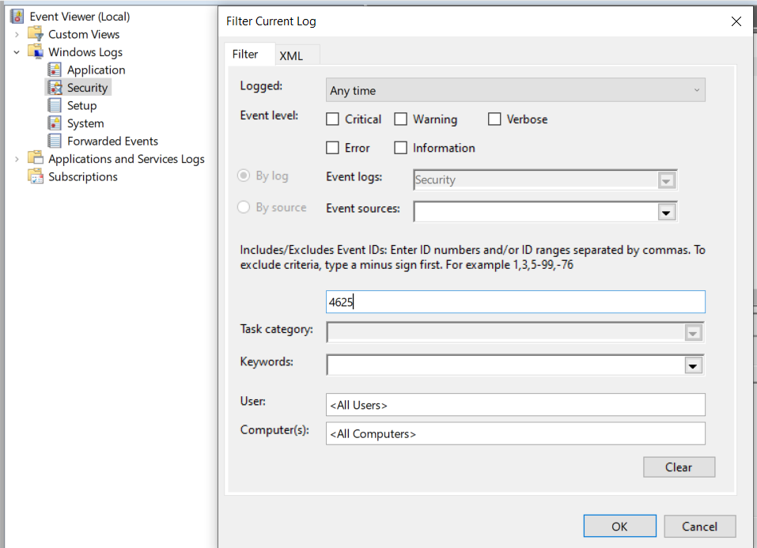

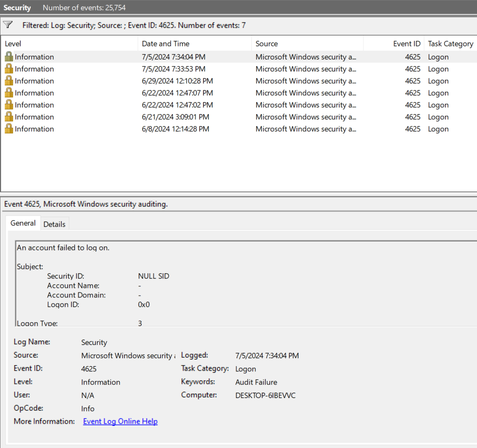

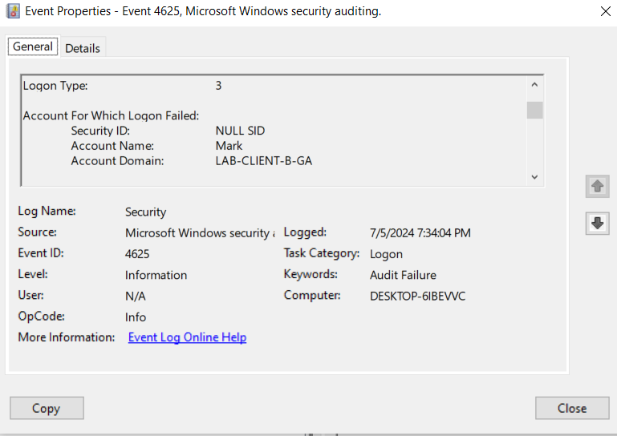
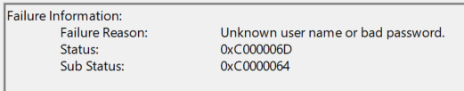
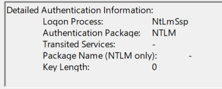

#### Monitor Successful Logins

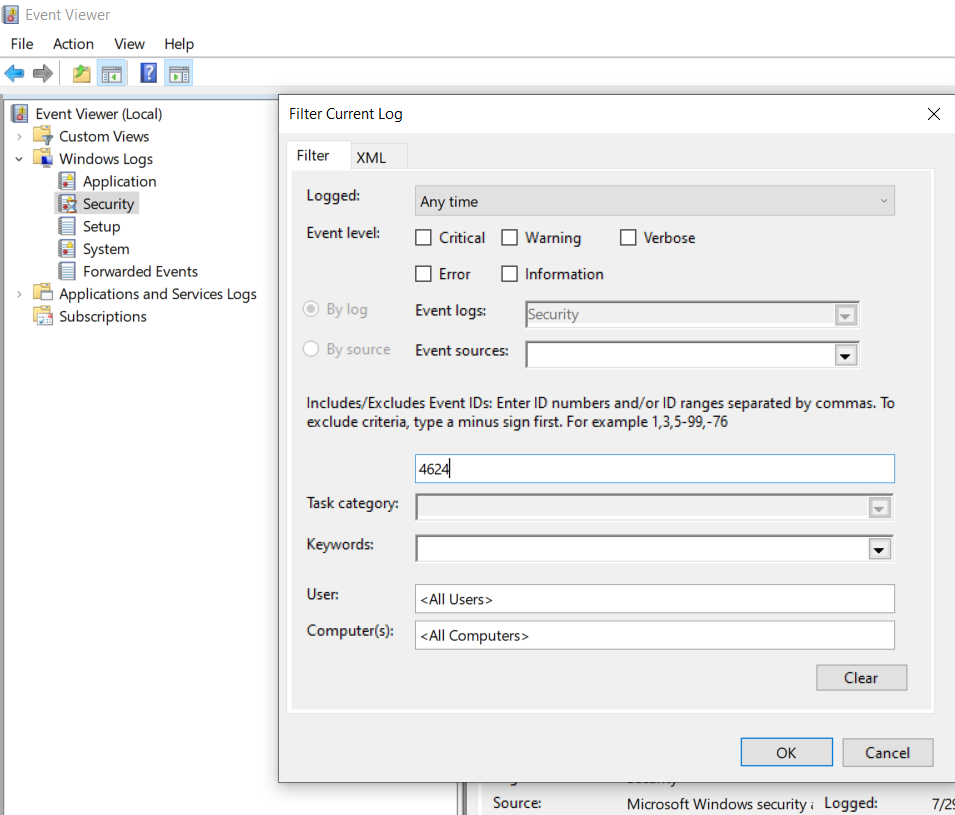

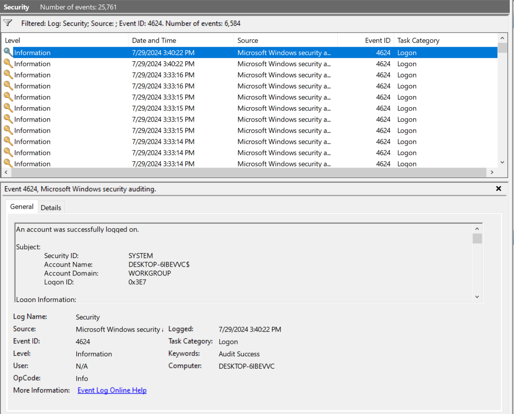

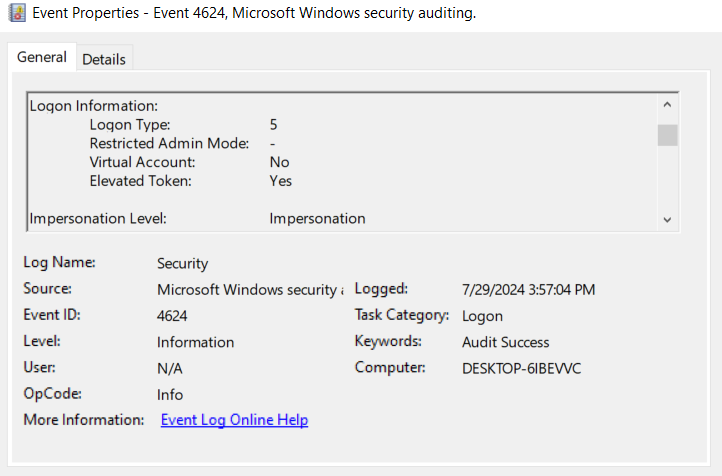
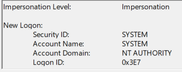
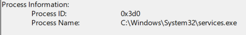

#### Look for Special Privileges Assigned to New Logon

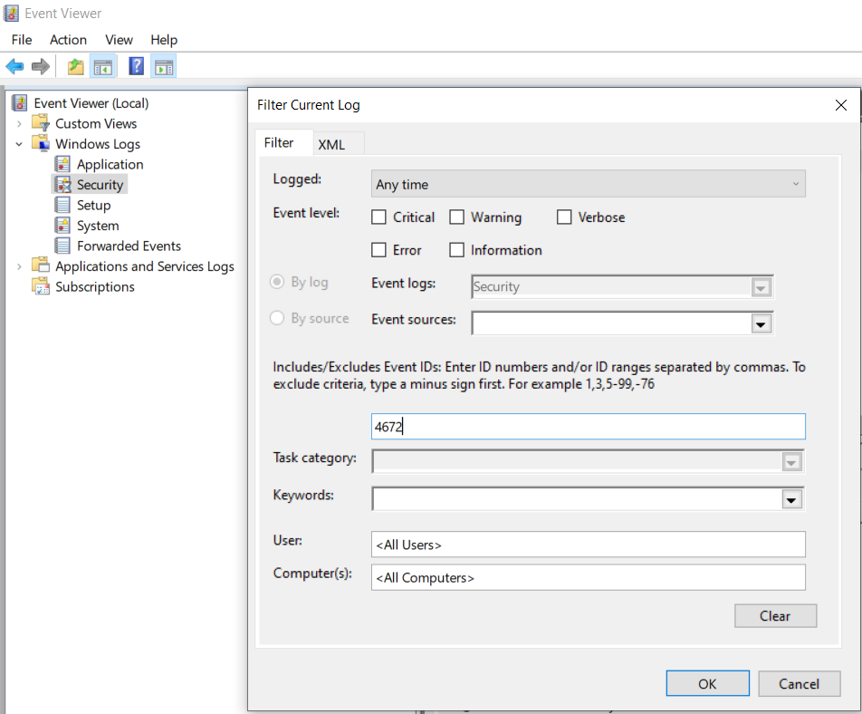

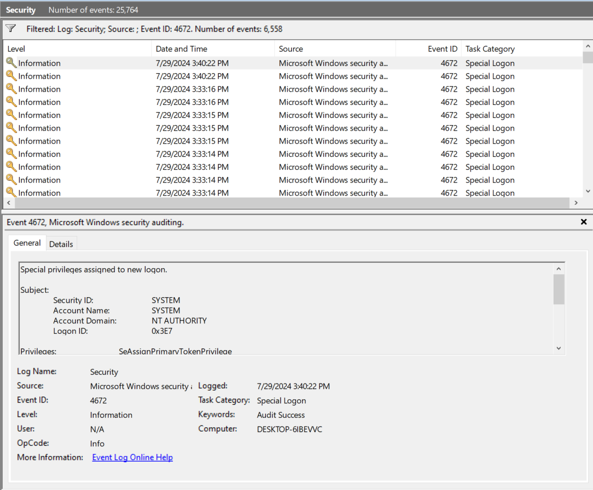

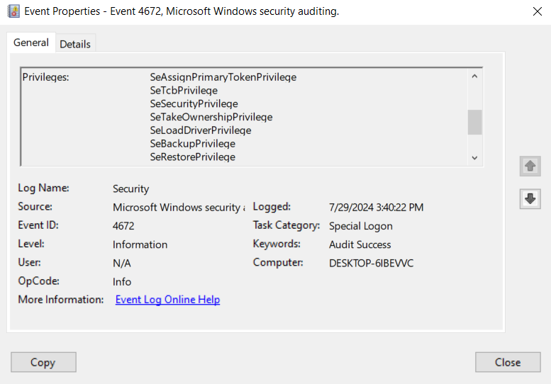

### Monitoring with PowerShell Scripts

#### Monitor Failed Login Attempts

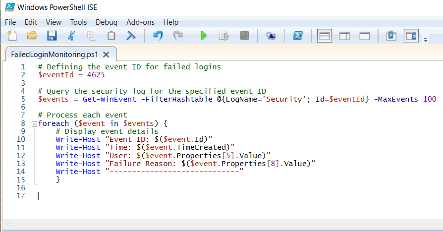

#### Monitor Successful Logins

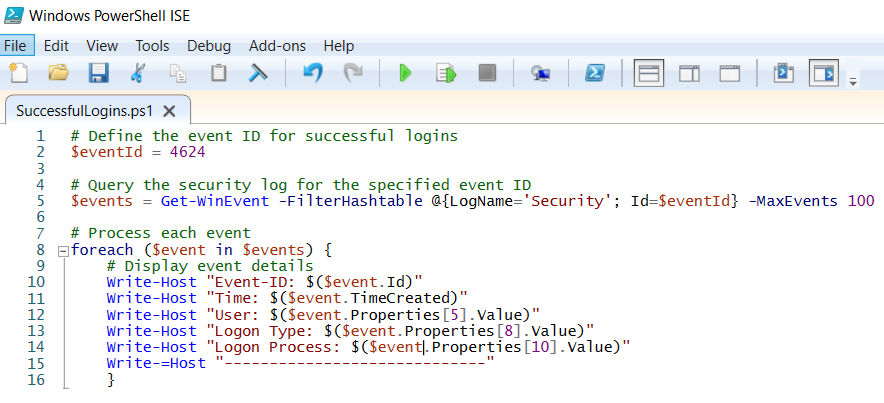

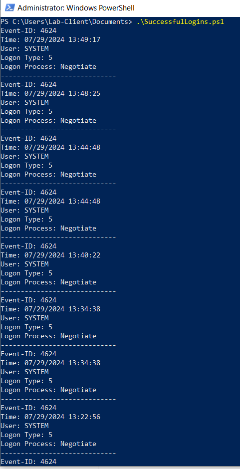

#### Monitor New Process Creation Events

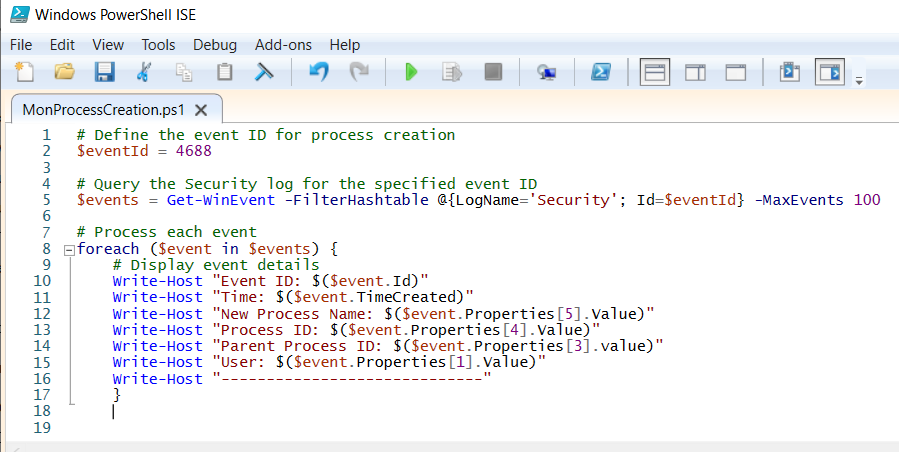

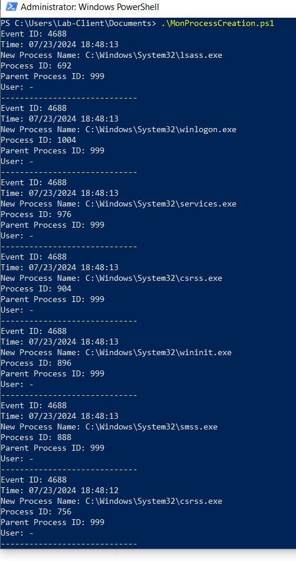

